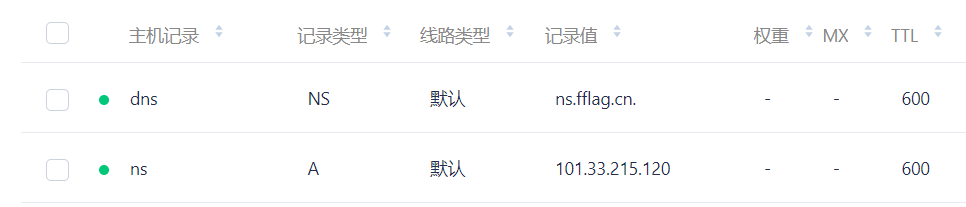
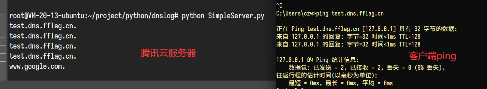

## 自实现DNSLog的意义及作用：

- 一些公共DNSLog服务可能已进入防火墙黑名单。不依赖他人服务器，增加可靠性。
- 结合自己的漏洞扫描工具，更定制化修改和部署DNSLog API。达到更高的效率。
- 附加实现DNS重绑定攻击等其他功能
- 熟悉DNSLog底层技术原理

## DNSLog原理
> http://blog.fflag.cn/archives/33/

## 使用方式
首先我们需要一个域名和一个带公网ip的服务器

假设服务器ip为 1.1.1.1，服务器ip为fflag.cn



1、给我们自己的服务器添加一条A记录域名解析

```
ns.fflag.cn  A 记录指向  1.1.1.1
```

2、将NS权威服务器指向我们自己的服务器

```
dns.fflag.cn  NS 记录指向  ns.fflag.cn
```

3、在Linux服务器上，需要先关闭named和systemd-resolve服务，否则数据包到不了我们的处理程序

```bash
systemctl stop named
systemctl stop resolved
```

4、运行代码

```bash
git clone https://github.com/chenzhouwen/DNSLog.git
# 或者自己下载
cd DNSLog

python3 SimpleServer.py
```

5、测试运行效果



客户端成功记录下 dnslog

## 感谢项目
> https://github.com/paulc/dnslib