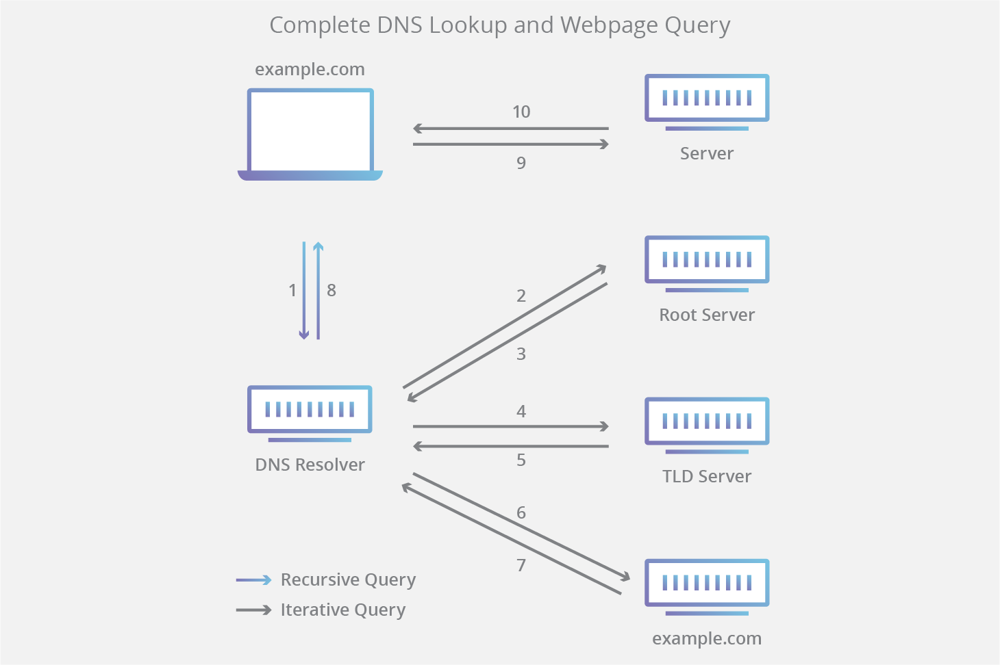

自实现DNSLog服务器的意义及作用：

- 一些公共DNSLog服务可能已进入防火墙黑名单。不依赖他人服务器，增加可靠性。
- 结合自己的漏洞扫描工具，更定制化修改和部署DNSLog API。达到更高的效率。
- 附加实现DNS重绑定攻击等其他功能
- 熟悉DNSLog底层技术原理

以下将介绍DNS，理解以下概念，对我们理解DNSLog的原理并实现DNSLog非常重要。如果您已了解这部分知识，请跳过本节，直接阅读 **DNSLog实现** 一节。
# DNS基本概念
DNS 是一个分布式分层数据库，用于存储 IP 地址和其他数据，提供从域名到网络地址的查询服务。DNS 目录存储在全球范围内分布的域名服务器上，并会定期更新。
## DNS记录类型
**记录**是 DNS 资源和域名之间的映射。一些常用的记录类型如下：

- **A**：地址记录，用于将主机名映射到其 IPv4 地址。
- **CNAME**：规范名称记录，用于将主机名指定别名。
- **NS**：域名服务器记录，用于将 DNS 地区委托给**权威服务器**。
## DNS服务器类型
### 权威服务器 Authoritative Nameserver
权威性 DNS 服务器是实际持有并负责 DNS 资源记录（包括 A、AAAA 和 CNAME）的服务器。这是位于 DNS 查找链底部的服务器。
**最终我们要实现的服务器就是这个。**
### 递归解析器 Recursive Resolver
递归解析器是将查询发送到权威服务器或非权威服务器以进行解析的服务器。我们上网有时候手动设置的8.8.8.8，114.114.114.114等就属于递归解析器。递归解析器正如其名，它对给定名称依次执行查询，并返回最终结果。
为执行此操作，其发出一系列请求，直至到达用于所请求的记录的**权威性 DNS 域名服务器**为止。

## DNS解析步骤


1. 用户在客户端访问 “example.com”时（可能是浏览器，也可能是ping，或者其他客户端应用），查询传输到 Internet 中，并被 DNS 递归解析器接收。
1. 接着，解析器查询 DNS 根域名服务器（.）。
1. 然后，根服务器使用存储其域信息的顶级域（TLD）DNS 服务器（例如 .com 或 .net）的地址响应该解析器。在搜索 example.com 时，我们的请求指向 .com TLD。
1. 然后，解析器向 .com TLD 发出请求。
1. TLD 服务器随后使用该域的域名服务器 example.com 的 IP 地址进行响应。
1. 最后，递归解析器将查询发送到域的域名服务器。
1. example.com 的 IP 地址而后从域名服务器返回解析器。
# DNSLog实现
至此，根据上面的解析原理，我们要做的事情就很简单了，我们只需要在顶级域名服务器上添加一条NS记录，将NS权威服务器指向我们自己的服务器，然后再编写DNS处理程序部署在我们自己的服务器上就好了。
## 我们要实现的功能

- 实现域名请求记录
- 实现DNS重绑定
## 技术分析
DNS服务运行在53端口的UDP协议上。
DNS服务器部分我们使用python3编写，对DNS数据包的处理使用dnslib库。
项目地址
> [https://github.com/paulc/dnslib](https://github.com/paulc/dnslib)
> [https://pypi.org/project/dnslib/](https://pypi.org/project/dnslib/)

## 代码实现
```bash
# SimpleServer.py
import socket
from dnslib import DNSRecord, DNSHeader, RR, A

dns_socket = socket.socket(socket.AF_INET, socket.SOCK_DGRAM)
dns_socket.bind(('0.0.0.0', 53))

while True:
    data, address = dns_socket.recvfrom(1024)
    request = DNSRecord.parse(data)
    qname = request.q.qname
    reply = DNSRecord(
        DNSHeader(id=request.header.id, qr=1, aa=1, ra=1),
        q=request.q,
        a=RR(qname, rdata=A("127.0.0.1"))
    )
    dns_socket.sendto(reply.pack(), address)
    print(qname) #此处可以打印到输出，也可以自行保存到数据库或者文件中

```
## 使用方式
首先我们需要一个域名和一个带公网ip的服务器
假设服务器ip为 1.1.1.1，服务器ip为fflag.cn
1、给我们自己的服务器添加一条A记录域名解析
```
ns.fflag.cn  A 记录指向  1.1.1.1
```
2、将NS权威服务器指向我们自己的服务器
```
dns.fflag.cn  NS 记录指向  ns.fflag.cn
```

在Ubuntu等服务器上，需要先关闭named和systemd-resolve服务，否则数据包到不了我们的处理程序
```bash
systemctl stop named
systemctl stop resolved
```
项目所有代码已发布至GitHub
> [https://github.com/chenzhouwen/dnslog](https://github.com/chenzhouwen/dnslog)


参考文章：

> [1] [https://cloud.google.com/dns/docs/dns-overview](https://cloud.google.com/dns/docs/dns-overview)
> 
> [2] [https://www.cloudflare.com/zh-cn/learning/dns/what-is-dns/](https://www.cloudflare.com/zh-cn/learning/dns/what-is-dns/)


